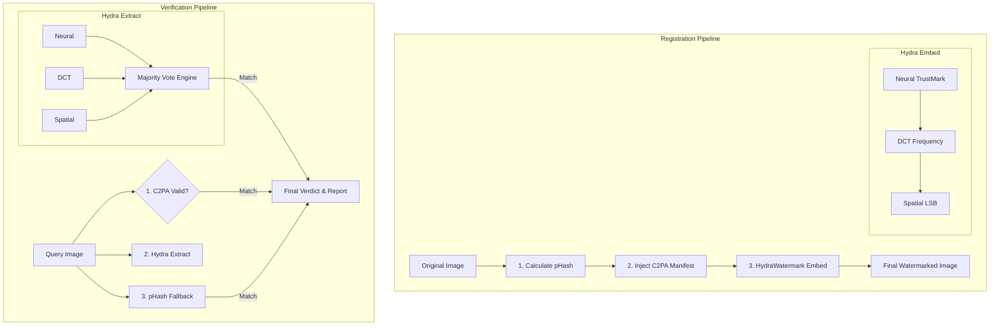

# PROVENA-FLASK: HydraWatermark V2

**AI Image Provenance & Triple-Redundant Forensic Verification System**

A state-of-the-art provenance tracking and forensic verification platform for AI-generated images. Provena V2 establishes a **Dual-Layered Forensic Truth** by combining unbreakable cryptographic metadata signatures (C2PA) with a highly resilient, triple-redundant pixel watermarking engine (HydraWatermark).

---

## Overview

PROVENA-FLASK is a comprehensive AI image provenance system designed to survive real-world hostile environments (social media compression, malicious cropping, metadata stripping). It guarantees origin traceability by anchoring the image identity in both the file structure and the pixels themselves.

### The Dual-Layered Philosophy

**Metadata + Pixels = Unbreakable Provenance**

Where most systems rely *only* on fragile watermarks or *only* on easily-stripped metadata, Provena V2 marries the two into a single, cohesive verification mesh:

1. **The Metadata Anchor (C2PA & Ed25519 Signatures)**: Injects an unforgeable, cryptographically signed manifest directly into the file's EXIF data. Survives pixel-level destruction (like heavy blurring or rotation).
2. **The Pixel Anchor (HydraWatermark V2)**: Embeds a 48-bit payload directly into the image pixels using three independent mathematical domains. Survives metadata stripping (like uploading to Twitter or WhatsApp).
3. **The Visual Anchor (pHash)**: Acts as a final safety net to catch visually identical images even if both the metadata and watermarks are destroyed.

---

## What This System Proves

### ✅ Pixel-Level Forensic Anchor (HydraWatermark)
- **Triple-Redundant Resilience**: Embeds the origin payload simultaneously via Neural networks, Frequency modulation (DCT), and Spatial algorithms (LSB).
- **Targeted Survivability**: Even if an attacker crops the image (destroying the spatial layer) or compresses it (destroying the frequency layer), the Neural layer survives and reconstructs the payload.
- **Majority Vote Consensus**: Validates extraction using a robust consensus engine to filter out noise and false positives.

### ✅ Cryptographic Truth (C2PA)
- **Metadata Integrity**: Cryptographic proof that the image was registered with specific metadata (model, timestamp).
- **Tamper Detection**: Metadata cannot be altered without invalidating the Ed25519 signature.
- **Provenance Chain**: Complete audit trail stored in an append-only SQLite registry.

---

## Architecture

### System Flow (V2)



### Verification Hierarchy

**Tier 1 (Authoritative)**: Cryptographic Signature (C2PA) + Registry  
**Tier 2 (Pixel-Proof)**: HydraWatermark Extraction (Majority Vote)  
**Tier 3 (Fallback)**: Perceptual Hash Matching  

---

## Key Features

### 🎨 Forensic Watermarking: HydraWatermark V2
A state-of-the-art orchestration engine that layers three watermarks without visual interference:
- **Neural Layer (Adobe TrustMark)**: A deep-learning encoder/decoder highly resistant to JPEG compression, resizing, and minor cropping.
- **Frequency Layer (DCT Block QIM)**: Modulates 8x8 DCT blocks. Survives color shifts, blurring, and brightness attacks.
- **Spatial Layer (LSB with Repetition ECC)**: A purely mathematical checksum embedded in the Least Significant Bits using a dimension-seeded PRNG. Acts as a lossless exact-match verification.
- **Majority Vote Engine**: Intelligently aggregates the 48-bit extractions, requiring consensus to confidently verify the image origin.

### ⚔️ The Adversarial Forge (`adversarial_forge.py`)
A built-in stress-testing suite designed to simulate real-world hostile environments. The Forge automatically attacks the watermarked image using:
- Heavy JPEG Compression (Q=50)
- Gaussian Blurring
- Malicious Cropping
- Brightness / Contrast shifts
- Gaussian Noise

The Forge then runs the Verification pipeline against the damaged images to prove the resilience of the HydraWatermark layers.

### 🔐 Cryptographic Provenance
- **Ed25519 Digital Signatures**: Industry-standard elliptic curve cryptography.
- **Append-Only Registry**: Tamper-evident SQLite database mapping payloads to origins.

---

## Testing & Automation

### Run the Adversarial Forge
To prove the resilience of the watermarks against compression and filters:
```bash
python -m provena_flask.services.adversarial_forge
```

### Run the Hydra Round-Trip Test
To verify that all 3 layers successfully embed and extract without corruption:
```bash
python test_hydra.py
```

---

## API Usage (Python)

### Register Image
```python
import requests
import base64

with open('image.png', 'rb') as f:
    image_b64 = base64.b64encode(f.read()).decode()

response = requests.post('http://localhost:5000/api/v1/images/register', json={
    'image': image_b64,
    'model_id': 'gpt-vision-v1',
    'timestamp': '2026-05-05T19:00:00Z'
})

result = response.json()
print(f"Image ID: {result['image_id']}")
```

### Verify Image
```python
response = requests.post('http://localhost:5000/api/v1/images/verify', json={
    'image': image_b64
})

result = response.json()
print(f"Verdict: {result['status']}")
print(f"Signature Valid: {result['verification']['signature_valid']}")
print(f"HydraWatermark Extracted: {result['verification']['watermark_extracted']}")
print(f"Layer Breakdown: {result['verification']['hydra_layers']}")
```

---

## Installation

### Prerequisites
- Python 3.8+
- PyTorch (for TrustMark Neural Layer)
- OpenCV, Scipy, Numpy, Pillow

### Setup

```bash
git clone <repository-url>
cd ai-image-provenance-system

python -m venv venv
# Windows: .\venv\Scripts\activate
# Linux/Mac: source venv/bin/activate

pip install -r requirements.txt
```

### Run Server
```bash
python run.py
```
Server will start on `http://localhost:5000`. Navigate to the browser to access the sleek, visual Verification UI.

---

## System Limitations (Honest Assessment)

- **Complete Pixel Destruction**: If an image is heavily cropped *and* heavily compressed *and* resized simultaneously, the HydraWatermark may fail. The system will then fall back to the pHash (Perceptual Hash) to flag the image as "Modified".
- **Blind Watermarking**: Extraction is "blind" (no original image reference), meaning it relies entirely on the surviving mathematical properties of the pixels.
- **Timestamp Trust**: Timestamps are self-reported by the API caller during registration, not independently verified by a blockchain.

---

**PROVENA-FLASK**: Establishing the ultimate forensic truth for AI-generated images.
