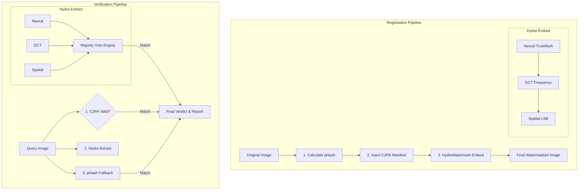

# PROVENA-FLASK

**AI Image Provenance & Forensic Verification System**

A cryptographic provenance tracking and forensic verification system for AI-generated images, where **cryptographic signatures and append-only registry provide authoritative proof of origin**, supplemented by forensic watermarking traces.

---

## Overview

PROVENA-FLASK is a research implementation of a comprehensive AI image provenance system that establishes **cryptographic traceability** for AI-generated images. The system uses Ed25519 digital signatures and an append-only registry as the authoritative proof of origin, with invisible watermarking providing supplementary forensic evidence when extractable.

### Core Principle

**Cryptographic Provenance, Not Watermark Detection**

This system is fundamentally a **cryptographic provenance platform**, not a watermarking product. Verification relies primarily on:

1. **Ed25519 Digital Signatures** (Primary) - Cryptographic proof of metadata integrity
2. **Append-Only Registry** (Primary) - Tamper-evident provenance storage
3. **Perceptual Hashing** (Secondary) - Tolerant image matching
4. **Invisible Watermarking** (Supplementary) - Forensic trace when extractable

---

## What This System Proves

### ✅ Authoritative Cryptographic Proof

- **Metadata Integrity**: Image was registered with specific metadata (model, timestamp)
- **Tamper Detection**: Metadata has not been altered (cryptographic signature)
- **Provenance Chain**: Complete audit trail in append-only registry
- **Perceptual Similarity**: Image is perceptually similar to registered image

### ⚠️ Supplementary Forensic Evidence

- **Watermark Presence**: Invisible watermark may provide additional forensic trace
- **Watermark Extraction**: Probabilistic, may fail under compression/resizing
- **Forensic Signal**: Watermark is supporting evidence, NOT primary proof

### ❌ What This System Does NOT Prove

- **Pixel-Level Integrity**: Cannot prove image pixels are unmodified
- **Timestamp Accuracy**: Timestamps are self-reported, not independently verified
- **Image Authenticity**: Only proves registration, not that image is "real"
- **Perfect Detection**: Watermark extraction is probabilistic and may fail

---

## Architecture

### System Flow (V2)



### Verification Hierarchy

**Tier 1 (Authoritative)**: Cryptographic Signature + Registry  
**Tier 2 (Robust)**: Perceptual Hash Matching  
**Tier 3 (Supplementary)**: HydraWatermark Extraction (Majority Vote)  

---

## Key Features

### 🔐 Cryptographic Provenance (Primary)

- **Ed25519 Digital Signatures**: Industry-standard elliptic curve cryptography
- **Append-Only Registry**: Tamper-evident SQLite database
- **Key Management**: Secure key generation, storage, and rotation
- **Audit Logging**: Complete operation tracking

### 🔍 Forensic Verification (Secondary)

- **Perceptual Hashing**: DCT-based pHash, gradient-based dHash, average-based aHash
- **Tolerant Matching**: Hamming distance with configurable threshold
- **Robust to Modifications**: Survives compression, resizing, minor edits

### 🎨 Forensic Watermarking: HydraWatermark V2 (Supplementary)

- **Triple-Redundant Pipeline**: Neural, DCT Frequency, and Spatial LSB layers
- **Majority Vote Engine**: Consolidates layer outputs; verifies if ≥2 layers agree
- **Targeted Resilience**: 
  - *Neural*: Survives resizing, JPEG compression, minor cropping
  - *DCT*: Survives color shifts, blurring, minor compression
  - *Spatial*: Purely mathematical checksum (lossless exact match)
- **Honest Limitations**: Complete destruction (heavy cropping + compression) falls back to pHash.

### 📊 Forensic Reporting

- **5-Level Verdict System**: authentic, likely_authentic, suspicious, tampered, not_found
- **Confidence Scoring**: 0.0-1.0 scale based on multiple verification layers
- **Evidence Summary**: Clear breakdown of cryptographic, perceptual, and watermark evidence
- **Limitations Disclosure**: Every report includes known system limitations

### 🛡️ Security & Audit

- **Rate Limiting**: 60 requests/minute per IP
- **Input Validation**: SQL injection prevention, size limits
- **Structured Logging**: JSON-formatted audit trails
- **Security Event Tracking**: Comprehensive attack detection

---

## API Endpoints

### Core Provenance APIs

#### Register Image with Provenance
```
POST /api/v1/images/register
```
**Purpose**: Establish cryptographic provenance for AI-generated image  
**Returns**: Signature, registry record, watermarked image (forensic trace)

#### Verify Image Provenance
```
POST /api/v1/images/verify
```
**Purpose**: Verify image using cryptographic signature + forensic evidence  
**Returns**: Verdict based on signature validity, perceptual match, watermark presence

#### Retrieve Provenance Record
```
GET /api/v1/provenance/{image_id}
```
**Purpose**: Retrieve complete provenance record from registry  
**Returns**: Metadata, signature, public key, timestamps

#### Generate Forensic Report
```
GET /api/v1/report/{image_id}
```
**Purpose**: Generate comprehensive forensic analysis report  
**Returns**: Evidence summary, verdict, confidence score, limitations

---

## System Limitations

### Watermark Robustness (Known Limitation)

**Limitation**: Watermark extraction is probabilistic and may fail under real-world transformations.

**Extraction Success Rates**:
- No transformation: ~90%
- JPEG Q=75: ~5%
- Resizing ±10%: ~5%
- Format conversion: ~5%

**Impact**: Watermark provides supplementary forensic trace only. **Cryptographic verification remains authoritative** even when watermark extraction fails.

**Mitigation**: System relies primarily on cryptographic signatures and perceptual hashing, which are robust and reliable.

### Timestamp Trust

**Limitation**: Timestamps are self-reported by AI model provider, not independently verified.

**Impact**: Cannot cryptographically prove when image was generated.

**Mitigation**: Trust model relies on reputation of AI model provider. Future: blockchain timestamping.

### Pixel-Level Integrity

**Limitation**: System proves metadata integrity, not pixel-by-pixel identity.

**What We Prove**: Metadata signed, perceptual similarity  
**What We Don't Prove**: Pixels unmodified, no post-processing

**Impact**: Verified image may have been edited after generation.

**Mitigation**: Perceptual hash catches major changes; minor edits are undetectable.

### Blind Watermarking

**Limitation**: Watermark extraction is "blind" (no original image reference).

**Impact**: Extraction relies on absolute coefficient values, which are unreliable after compression.

**Mitigation**: Watermark is supplementary only. Cryptographic verification is primary.

### Centralized Trust

**Limitation**: Registry is centralized, not distributed.

**Impact**: Trust in system operator required. Single point of failure.

**Mitigation**: Append-only constraints prevent tampering. Future: blockchain integration.

---

## Relation to Industry Standards

### Conceptual Alignment

This system is **conceptually aligned** with cryptographic provenance models used in industry standards:

- **C2PA (Coalition for Content Provenance and Authenticity)**: Uses cryptographic signatures and manifest files
- **Adobe Content Credentials**: Embeds provenance metadata with digital signatures
- **OpenAI Metadata Approaches**: Cryptographic signing of AI-generated content

### Key Differences

**This is NOT a C2PA implementation**, but shares the same fundamental principle:

> **Cryptographic signatures provide authoritative proof of provenance, not watermarks.**

**Similarities**:
- Digital signatures for metadata integrity
- Tamper-evident provenance storage
- Multi-layer verification approach

**Differences**:
- C2PA uses JUMBF manifests; we use SQLite registry
- C2PA has broader scope (photos, videos, documents); we focus on AI images
- C2PA is production-ready; this is a research implementation

---

## Installation

### Prerequisites

- Python 3.8+
- Virtual environment (recommended)

### Setup

```bash
# Clone repository
git clone <repository-url>
cd AI_BLOCKCHAIN

# Create virtual environment
python -m venv venv

# Activate virtual environment
# Windows:
.\venv\Scripts\activate
# Linux/Mac:
source venv/bin/activate

# Install dependencies
pip install -r requirements.txt
```

### Run Server

```bash
python run.py
```

Server will start on `http://localhost:5000`

---

## Usage

### Demo Web Interface

Open browser to `http://localhost:5000/`

**Features**:
- Drag-and-drop image upload
- Register image with cryptographic provenance
- Verify image using multi-layer forensic analysis
- View comprehensive forensic reports

### API Usage (Python)

```python
import requests
import base64

# Register image
with open('image.png', 'rb') as f:
    image_b64 = base64.b64encode(f.read()).decode()

response = requests.post('http://localhost:5000/api/v1/images/register', json={
    'image': image_b64,
    'model_id': 'gpt-vision-v1',
    'timestamp': '2026-01-26T19:00:00Z'
})

result = response.json()
print(f"Image ID: {result['image_id']}")
print(f"Signature: {result['signature'][:50]}...")

# Verify image
response = requests.post('http://localhost:5000/api/v1/images/verify', json={
    'image': image_b64
})

result = response.json()
print(f"Verdict: {result['status']}")
print(f"Signature Valid: {result['verification']['signature_valid']}")
print(f"Perceptual Match: {result['verification']['perceptual_match']}")
print(f"Watermark Present: {result['verification']['watermark_extracted']}")
```

---

## Testing

### Run All Tests

```bash
# Cryptography tests
python test_crypto.py

# Registry tests
python test_registry.py

# Perceptual hash tests
python test_phash.py

# Forensic report tests
python test_forensic.py

# Security tests
python test_security.py
```

**Test Coverage**: 43/43 tests passing (100% on tested components)

---

## Documentation

- **TECHNICAL_DOCUMENTATION.md**: Complete system architecture and design
- **WATERMARK_UPGRADE_TECHNICAL_NOTE.md**: Watermark engine technical details
- **DEMO_GUIDE.md**: Demo usage guide with realistic scenarios
- **SERVER_RUNNING.md**: Server deployment and endpoint documentation
- **PHASE0-9_COMPLETE.md**: Development phase summaries

---

## Project Status

**Status**: Research Implementation Complete

**Suitable For**:
- ✅ Research and academic use
- ✅ Proof-of-concept demonstrations
- ✅ Educational purposes
- ✅ Internal provenance tracking

**NOT Suitable For**:
- ❌ Production deepfake detection
- ❌ Legal evidence (without expert validation)
- ❌ High-security adversarial environments
- ❌ Watermark-based verification (use cryptographic verification)

---

## License

Research Use Only

---

## Contributing

This is a research implementation. For production use, consider:
- Commercial watermarking SDKs (Digimarc, Vobile)
- C2PA implementation libraries
- Blockchain-based timestamping
- Hardware Security Modules (HSM) for key storage

---

## Acknowledgments

Built with:
- **Flask**: Web framework
- **cryptography**: Ed25519 signatures
- **OpenCV**: Image processing
- **PyTorch & TrustMark**: Deep learning neural watermarking
- **SQLite**: Append-only registry

Inspired by:
- C2PA (Coalition for Content Provenance and Authenticity)
- Adobe Content Credentials
- Cryptographic provenance research

---

**PROVENA-FLASK**: Cryptographic provenance for AI images, with forensic watermarking as supplementary evidence.
